# Aide Panovisu

## Table des matières

- [Premiers pas](#premiers-pas)
- [Les Menus](#les-menus)
  - [Menu Projets](#menu-projets)
  - [Menu Panoramiques](#menu-panoramiques)
  - [Menu Modèles](#menu-modèles)
  - [Menu Outils](#menu-outils)
  - [Menu Aide](#menu-aide)
  - [La barre d'icônes](#la-barre-dicônes)
- [L'éditeur de visite](#léditeur-de-visite)
- [L'éditeur d'interface](#léditeur-dinterface)
- [Les Outils](#les-outils-1)
- [L'éditeur de plan](#léditeur-de-plan)

---

## Premiers pas ou comment réaliser une visite en 5 minutes

⚠️ **N'oubliez pas de sauvegarder votre projet régulièrement**

### Dans l'onglet visite

1. **Charger les panoramiques** (menu Visite ⇒ Ajouter panoramiques ou **Ctrl+A** (PC) ou **Cmd+A** (Mac))

   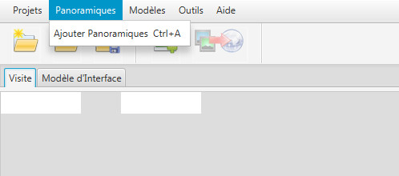

2. **Choisir le panoramique d'entrée**

   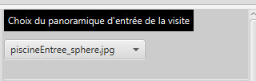

3. **Choisir le titre de chacun des panoramiques**

   

4. **Créer les liaisons entre les panoramiques :**

   - **Clic bouton gauche** sur la vue panoramique pour choisir l'emplacement du Hotspot

     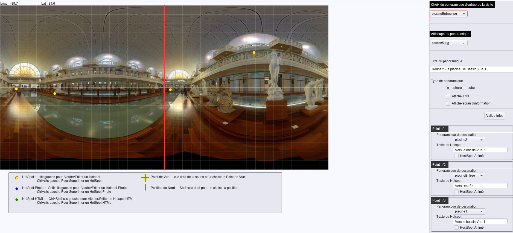

   - Choisissez le panoramique lié par le hotspot en **clic bouton gauche** sur son image (vous pourrez l'éditer en recliquant sur le point ou en choisissant le panoramique lié par l'intermédiaire de la boîte de choix).

     

     Le texte du lien créé sera le titre du panoramique sélectionné par défaut (vous pouvez l'éditer)

     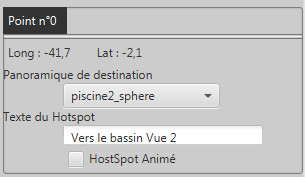

   - Si vous vous êtes trompé vous pouvez supprimer le point en utilisant la combinaison (**Ctrl+clic gauche** (PC) ou **Cmd+clic gauche** (Mac) sur le point)

   - Vous pouvez de la même manière créer un lien vers une image en utilisant la combinaison **Shift+clic gauche**

   Dans l'interface :
   - La ligne rouge représente la direction du nord
   - La croix violette le point de vue d'entrée du panoramique
   - Les points jaune/rouge les hotspots vers les autres panoramiques

   

5. Pour chacun des panoramiques vous pouvez également choisir le **point de vue d'entrée** (**clic droit**) - la direction dans laquelle se porte le regard lorsque le panoramique est chargé. Le centre de l'image est choisi par défaut.

6. De même si vous comptez utiliser la boussole choisissez la **position du nord** (**Shift + clic droit**)

---

### Dans l'onglet Modèle d'interface


1. **Choisissez la couleur générale de l'interface.** La couleur de chacun des éléments pourra ensuite être choisie individuellement.

   

2. **Paramétrez le titre** (choix de la police, de sa taille, couleurs, etc...)

   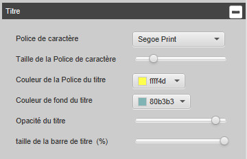

3. **Paramétrez la barre de navigation** (forme des boutons, couleur, position, etc...)

   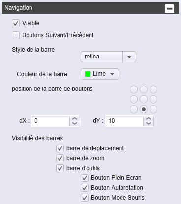

4. **Paramétrez les hotspots** (forme et couleur)

   

5. **Paramétrez la boussole** (affichage, forme, position, etc...)

   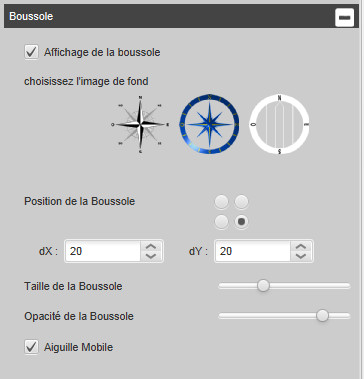

6. **Paramétrez le bouton de masquage** (affichage, position, couleur, ainsi que les éléments à masquer par le bouton)

   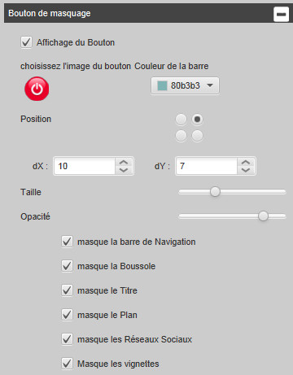

7. **Paramétrez les réseaux sociaux** (affichage, choix des réseaux à afficher)

   

8. **Paramétrez l'affichage des vignettes** des panoramiques (position, couleur de fond, taille des vignettes)

   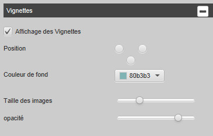

💡 **Vous pouvez sauvegarder le modèle que vous venez de créer** pour une utilisation ultérieure en utilisant le menu modèles.


---

### Génération de la visite

Si vous n'avez pas encore sauvé votre visite faites-le, puis **générez votre visite** en utilisant le menu visite (ou la combinaison de touche **Ctrl+V** (PC) ou **Cmd+V** (Mac)). La visite sera générée dans le répertoire de sauvegarde dans un sous-répertoire `visite`.


Une fois la génération effectuée, la visite sera ouverte dans votre navigateur préféré.

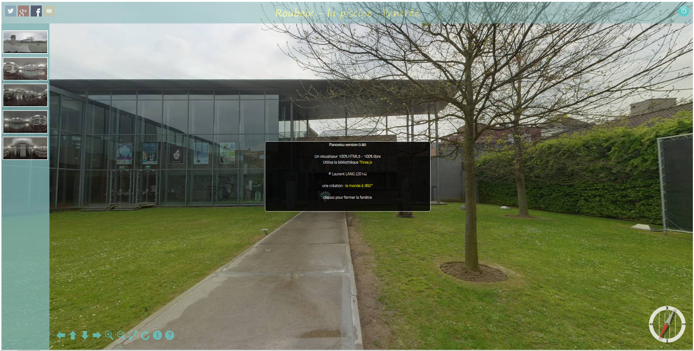

---

## Les Menus

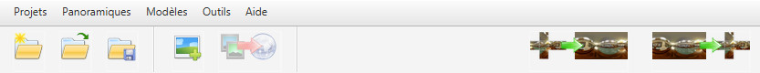

Le menu principal de EditeurPanovisu est organisé en 6 sections principales qui vous permettent de gérer tous les aspects de votre visite virtuelle.

### Menu Projets

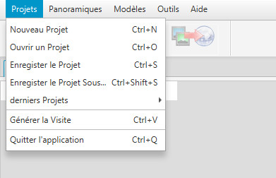

Le menu **Projets** regroupe toutes les fonctionnalités de gestion de vos fichiers de projet de visite virtuelle (`.pvu`).

#### Nouveau Projet (Ctrl+N / Cmd+N)
Crée un nouveau projet vierge. Vous serez invité à sauvegarder votre projet en cours si vous avez des modifications non enregistrées.

#### Ouvrir un Projet (Ctrl+O / Cmd+O)
Ouvre une boîte de dialogue pour sélectionner un fichier de projet existant (`.pvu`) sur votre disque dur.

#### Enregistrer le Projet (Ctrl+S / Cmd+S)
Sauvegarde les modifications du projet en cours. Le fichier `.pvu` contient toute la configuration de votre visite : panoramiques, hotspots, paramètres d'interface, etc.

⚠️ **Important** : Pensez à sauvegarder régulièrement votre travail pour éviter toute perte de données.

#### Enregistrer le Projet Sous... (Ctrl+Shift+S / Cmd+Shift+S)
Permet de sauvegarder votre projet sous un nouveau nom ou à un nouvel emplacement. Pratique pour créer des variantes d'une visite existante.

#### Projets récents
Cette sous-section affiche les 5 derniers projets ouverts, permettant un accès rapide à vos travaux récents. Cliquez simplement sur le nom d'un projet pour le rouvrir.

#### Quitter l'application (Ctrl+A / Cmd+A)
Ferme l'application EditeurPanovisu. Si vous avez des modifications non sauvegardées, l'application vous demandera si vous souhaitez les enregistrer avant de quitter.

### Menu Affichage

Le menu **Affichage** permet de basculer entre les différents onglets de l'éditeur et d'accéder aux outils de visualisation.

#### Création de la visite (Ctrl+1 / Cmd+1)
Affiche l'onglet **Visite** où vous pouvez ajouter vos panoramiques, créer les liens entre eux (hotspots), définir les points de vue d'entrée et la direction du nord.

#### Création de l'interface (Ctrl+2 / Cmd+2)  
Affiche l'onglet **Interface** où vous personnalisez l'apparence de votre visite : couleurs, navigation, boussole, titre, hotspots, réseaux sociaux, etc.

#### Éditeur de plan (Ctrl+3 / Cmd+3)
Affiche l'onglet **Plan** permettant d'afficher un plan (image) de votre site avec les positions des panoramiques. Cet onglet n'est actif que si vous avez ajouté un plan à votre projet.

#### Loupe (Ctrl+L / Cmd+L)
Active l'outil loupe qui permet de visualiser une zone agrandie de la vue panoramique. Pratique pour positionner précisément vos hotspots.

#### Configuration
Ouvre la fenêtre de configuration de l'application où vous pouvez définir :
- La langue de l'interface (Français, English, Deutsch, Português)
- Le répertoire de travail par défaut
- Les paramètres d'export
- Les préférences générales

### Menu Visite


Le menu **Visite** (anciennement "Panoramiques") contient les actions liées à la création et à la génération de votre visite virtuelle.

#### Ajouter Panoramiques (Ctrl+A / Cmd+A)
Ouvre un sélecteur de fichiers permettant d'ajouter un ou plusieurs panoramiques à votre projet. 

**Formats supportés** :
- Images équirectangulaires (`.jpg`, `.jpeg`, `.png`)
- Cubes (6 faces : `_f`, `_b`, `_u`, `_d`, `_r`, `_l`)

💡 **Astuce** : Vous pouvez sélectionner plusieurs fichiers en maintenant la touche **Ctrl** (PC) ou **Cmd** (Mac) enfoncée.

Une fois ajoutés, les panoramiques apparaissent dans la liste à gauche de l'onglet Visite. Vous pouvez ensuite leur donner un titre, définir leur point de vue d'entrée et créer des liens (hotspots) entre eux.

#### Ajouter Plan (Ctrl+P / Cmd+P)
Permet d'ajouter une image de plan (vue de dessus de votre site) à votre projet. Le plan sera affiché dans l'onglet **Plan** et pourra servir de navigation alternative dans votre visite.

**Formats supportés** : `.jpg`, `.jpeg`, `.png`

Une fois le plan ajouté, vous pourrez placer des marqueurs pour indiquer la position de chaque panoramique sur le plan.

#### Générer la visite (Ctrl+V / Cmd+V)
Lance la génération de votre visite virtuelle. EditeurPanovisu crée un sous-dossier `visite` dans le répertoire de votre projet contenant tous les fichiers nécessaires au fonctionnement de la visite :
- Les panoramiques optimisés
- Les fichiers HTML, CSS et JavaScript
- Les bibliothèques (Three.js, OpenLayers, etc.)
- Le fichier de configuration XML
- Les ressources (images, icônes, thèmes)

Une fois la génération terminée, la visite s'ouvre automatiquement dans votre navigateur web par défaut. Vous pouvez ensuite :
- La tester localement
- La copier sur un serveur web
- La graver sur CD/DVD
- L'intégrer à votre site web

⚡ **Note** : Le dossier `visite` est autonome et peut être déplacé librement. Il contient tout ce dont vous avez besoin pour diffuser votre visite virtuelle.

### Menu Modèles


Le menu **Modèles** vous permet de sauvegarder et de réutiliser vos configurations d'interface personnalisées.

#### Charger un modèle
Charge un fichier de modèle d'interface (`.modele`) préalablement sauvegardé. Toute la configuration de l'onglet **Interface** sera remplacée par celle du modèle :
- Couleurs du thème
- Police et taille du titre
- Style de la barre de navigation
- Forme et couleur des hotspots
- Configuration de la boussole
- Paramètres du bouton de masquage
- Réseaux sociaux affichés
- Style des vignettes

💡 **Usage** : Les modèles sont très utiles si vous créez plusieurs visites avec le même style graphique. Par exemple, toutes les visites d'un musée peuvent utiliser le même modèle pour conserver une cohérence visuelle.

#### Sauver un modèle
Sauvegarde la configuration actuelle de votre interface dans un fichier `.modele` que vous pourrez réutiliser dans d'autres projets.

**Le modèle sauvegarde** :
- ✅ Tous les paramètres de l'onglet Interface
- ✅ Les couleurs et styles personnalisés
- ✅ Les positions des éléments
- ❌ Pas les panoramiques ni les hotspots (qui sont spécifiques à chaque visite)

🎨 **Conseil** : Créez une bibliothèque de modèles correspondant à différentes ambiances ou types de visites (musée, immobilier, patrimoine, tourisme, etc.)

### Menu Outils

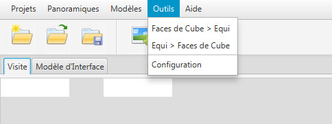

Le menu **Outils** regroupe les utilitaires de transformation d'images panoramiques et les outils annexes.

#### Équirectangulaire vers Cube
Convertit une image panoramique équirectangulaire (360°) en 6 faces de cube (faces avant, arrière, haut, bas, gauche, droite).

**Quand l'utiliser** :
- Pour optimiser l'affichage sur des appareils moins puissants
- Pour des viewers qui requièrent le format cube
- Pour réduire la taille des fichiers (les faces peuvent être compressées séparément)

**Formats générés** : 6 fichiers image avec suffixes `_f` (front), `_b` (back), `_u` (up), `_d` (down), `_l` (left), `_r` (right)

📏 **Options disponibles** :
- Choix de la résolution des faces
- Ajustements colorimétriques (luminosité, contraste, saturation)
- Format de sortie (JPG, PNG)

#### Cube vers Équirectangulaire
Convertit 6 faces de cube en une image panoramique équirectangulaire.

**Quand l'utiliser** :
- Vous avez reçu un panoramique au format cube (6 images)
- Vous voulez retravailler l'image dans un logiciel de retouche
- Vous devez publier sur une plateforme qui n'accepte que le format équirectangulaire

L'outil assemble intelligemment les 6 faces en une seule image panoramique 2:1 (deux fois plus large que haute).

📐 **Options disponibles** :
- Choix de la résolution de sortie
- Lissage des joints entre les faces
- Ajustements colorimétriques

#### Gestionnaire de barres (Ctrl+B / Cmd+B)
Ouvre l'outil de gestion des barres d'outils et de personnalisation de l'interface de EditeurPanovisu.

#### Gestionnaire de diaporama (Ctrl+D / Cmd+D)
Ouvre l'outil de création de diaporamas d'images qui peuvent être intégrés comme hotspots dans vos panoramiques.

**Utilisation** :
1. Créez un nouveau diaporama
2. Ajoutez des images
3. Configurez les transitions et les durées
4. Sauvegardez le diaporama
5. Dans votre panoramique, créez un hotspot de type "Diaporama" et sélectionnez votre diaporama

💡 **Cas d'usage** : Parfait pour afficher des galeries de photos dans un musée, des plans d'architecte dans un bien immobilier, ou des produits dans un showroom.

### Menu Aide


Le menu **Aide** donne accès à la documentation et aux informations sur l'application.

#### Documentation (F1)
Ouvre une fenêtre de visualisation de documentation avec un sélecteur permettant de choisir entre différents documents :
- **Aide Utilisateur** : Guide d'utilisation complet (ce document)
- **Présentation** : Présentation du logiciel et de ses fonctionnalités
- **Installation Ollama** : Guide pour installer et configurer Ollama pour la génération automatique de descriptions par IA

Les documents sont affichés dans un viewer intégré avec rendu Markdown, permettant une lecture confortable avec titres, images, tableaux et mise en forme.

💡 **Astuce** : Vous pouvez également ouvrir vos propres fichiers Markdown depuis le bouton "Ouvrir un fichier..." dans la fenêtre de documentation.

#### Aide (Ctrl+H / Cmd+H)
Ouvre cette aide utilisateur dans une fenêtre dédiée. 

📚 **Contenu** :
- Premiers pas et tutoriel rapide
- Documentation complète des menus
- Explication des fonctionnalités
- Astuces et recommandations

#### À propos
Affiche la fenêtre "À propos" contenant :
- Le nom et la version de l'application
- Les informations de copyright
- L'auteur et les contributeurs
- La licence d'utilisation
- Les bibliothèques tierces utilisées (Three.js, OpenLayers, jQuery, etc.)
- Les liens vers le site web et le support

### La barre d'icônes


La barre d'icônes offre un accès rapide aux fonctions les plus utilisées. Elle est située sous la barre de menus et contient les boutons suivants (de gauche à droite) :

#### 📄 Nouveau Projet
Crée un nouveau projet vierge. Équivalent à **Menu Projets → Nouveau Projet** (Ctrl+N / Cmd+N).

#### 📁 Ouvrir un Projet
Ouvre un projet existant depuis le disque. Équivalent à **Menu Projets → Ouvrir un Projet** (Ctrl+O / Cmd+O).

#### 💾 Enregistrer le Projet
Sauvegarde le projet en cours. Équivalent à **Menu Projets → Enregistrer le Projet** (Ctrl+S / Cmd+S). 
- ⚠️ Le bouton est grisé tant qu'aucun projet n'est ouvert.

---

#### ➕ Ajouter Panoramiques
Ajoute des panoramiques à votre visite. Équivalent à **Menu Visite → Ajouter Panoramiques** (Ctrl+A / Cmd+A).
- ⚠️ Le bouton est actif uniquement quand un projet est ouvert.

#### 🗺️ Ajouter Plan
Ajoute une image de plan à votre projet. Équivalent à **Menu Visite → Ajouter Plan** (Ctrl+P / Cmd+P).
- ⚠️ Le bouton est actif uniquement quand un projet est ouvert.

#### 🚀 Générer la visite
Lance la génération de la visite virtuelle. Équivalent à **Menu Visite → Générer la visite** (Ctrl+V / Cmd+V).
- ⚠️ Le bouton est actif uniquement quand au moins un panoramique est présent dans le projet.

---

#### 🔄 Équirectangulaire → Cube
Convertit une image équirectangulaire en 6 faces de cube. Équivalent à **Menu Outils → Équirectangulaire vers Cube**.
- 📐 Toujours disponible (indépendant du projet ouvert)

#### 🔄 Cube → Équirectangulaire  
Convertit 6 faces de cube en une image équirectangulaire. Équivalent à **Menu Outils → Cube vers Équirectangulaire**.
- 📐 Toujours disponible (indépendant du projet ouvert)

💡 **Astuce** : Survolez un bouton avec la souris pour afficher une infobulle décrivant sa fonction.

---

## L'éditeur de visite


### Le panneau de la vue panoramique

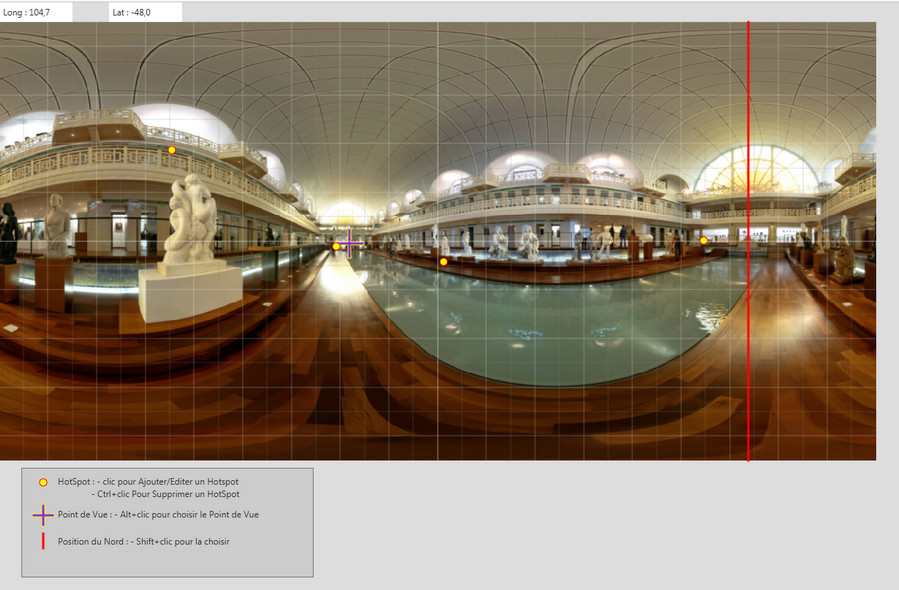

### La barre d'outils


#### Panoramique d'entrée


#### Les paramètres du panoramique


Cette section permet de configurer les informations descriptives de chaque panoramique :

- 📝 **Titre du panoramique** : Le nom qui sera affiché dans l'interface de la visite virtuelle
- 📍 **Géolocalisation** : Coordonnées GPS (latitude/longitude) du point de prise de vue
  - 🌐 Bouton "Géolocalisation" pour positionner le panoramique sur une carte OpenStreetMap ou Bing Maps
  - Les coordonnées peuvent être saisies manuellement ou cliquées sur la carte
- 📄 **Description manuelle** : Zone de texte pour décrire le panoramique

##### 🤖 Génération automatique de description par IA


EditeurPanovisu intègre une fonctionnalité révolutionnaire de génération automatique de descriptions par **Intelligence Artificielle** :

**Comment ça marche ?**

1. **Bouton "Générer description IA"** : Situé sous la zone de description, ce bouton lance la génération
2. **Contexte analysé** : L'IA utilise :
   - Le titre de la visite
   - Le titre du panoramique
   - Les coordonnées GPS (si disponibles)
   - La langue de l'interface (français, anglais, allemand, portugais)
3. **Génération intelligente** : En quelques secondes, l'IA produit une description pertinente et contextuelle

**Technologies utilisées :**

- 🏠 **Ollama (Local)** : Prioritairement utilisé si installé sur votre machine
  - ✅ **Gratuit et privé** : Vos données restent sur votre ordinateur
  - ⚡ Rapide et puissant (modèles Llama, Mistral, Gemma)
  - 📖 Voir Menu Aide → Documentation → Installation Ollama (F1) pour l'installation
- 🌐 **Hugging Face (Cloud)** : Utilisé en secours si Ollama n'est pas disponible
  - 🔑 Nécessite une connexion Internet
  - 💰 Gratuit pour usage normal

💡 **Astuce** : Pour des descriptions de qualité optimale, renseignez toujours le titre du panoramique et les coordonnées GPS avant de générer.

⚠️ **Important** : La première génération peut prendre 30-60 secondes le temps de charger le modèle. Les suivantes sont beaucoup plus rapides.

#### Les HotSpots


Les **HotSpots** (points chauds) sont des zones cliquables placées dans les panoramiques pour créer l'interactivité de la visite. EditeurPanovisu propose **4 types de HotSpots** :

##### 🏞️ HotSpot Panoramique (Navigation)
Permet de naviguer vers un autre panoramique de la visite.

**Configuration** :
- 🎯 **Panoramique cible** : Sélection du panoramique de destination dans la liste déroulante
- 📐 **Position** : Cliquez dans la vue pour placer le HotSpot (coordonnées sphériques)
- 🔵 **Style** : Couleur et forme définis dans l'éditeur d'interface
- 💬 **Info-bulle** : Texte affiché au survol (ex: "Aller à la chambre")

💡 **Astuce** : Utilisez des noms de panoramiques explicites pour faciliter la navigation (ex: "Salon Vue 1", "Cuisine Ouest")

##### 🖼️ HotSpot Image
Affiche une image en plein écran au clic (galerie photo, plan détaillé, etc.)

**Configuration** :
- 📁 **Fichier image** : Sélection de l'image (JPG, PNG, GIF)
- 📏 **Taille d'affichage** : Dimensions de l'image popup (px ou %)
- 🎨 **Opacité** : Transparence du fond derrière l'image (0-100%)
- 💬 **Info-bulle** : Description de l'image (ex: "Plan de la maison")

**Formats supportés** : JPG, JPEG, PNG, GIF, BMP, TIFF

##### 📽️ HotSpot Diaporama
Lance un diaporama automatique d'une série d'images avec transitions.

**Configuration** :
- 📂 **Dossier d'images** : Sélection du dossier contenant les photos du diaporama
- ⏱️ **Durée de transition** : Temps d'affichage de chaque image (secondes)
- 🎭 **Effet de transition** : Fondu enchaîné automatique
- 💬 **Info-bulle** : Description du diaporama (ex: "Photos du jardin")

⚠️ **Important** : Toutes les images du dossier sélectionné seront incluses dans le diaporama, dans l'ordre alphabétique.

##### 🌐 HotSpot HTML
Affiche une fenêtre HTML personnalisée (texte enrichi, lien externe, vidéo embarquée, etc.)

**Configuration** :
- 📝 **Contenu HTML** : Éditeur WYSIWYG pour créer le contenu
  - Texte formaté (gras, italique, couleurs)
  - Liens hypertextes
  - Images embarquées
  - Vidéos YouTube/Vimeo
- 📐 **Taille de fenêtre** : Largeur et hauteur de la popup (px)
- 📍 **Position** : Placement de la fenêtre (haut, bas, gauche, droite)
- 💬 **Info-bulle** : Description du contenu (ex: "Vidéo de présentation")

💡 **Astuce** : Utilisez les HotSpots HTML pour intégrer des formulaires de contact, des vidéos de démonstration ou des liens vers votre site web.

**Gestion des HotSpots** :
- ✏️ **Modifier** : Double-cliquez sur un HotSpot dans la liste pour éditer ses propriétés
- 🗑️ **Supprimer** : Sélectionnez et utilisez la touche `Suppr` ou le bouton `-`
- 👁️ **Afficher/Masquer** : Checkbox pour activer/désactiver temporairement un HotSpot
- 📋 **Dupliquer** : Copiez un HotSpot vers d'autres panoramiques avec `Ctrl+C` / `Ctrl+V`

---

## L'éditeur d'interface


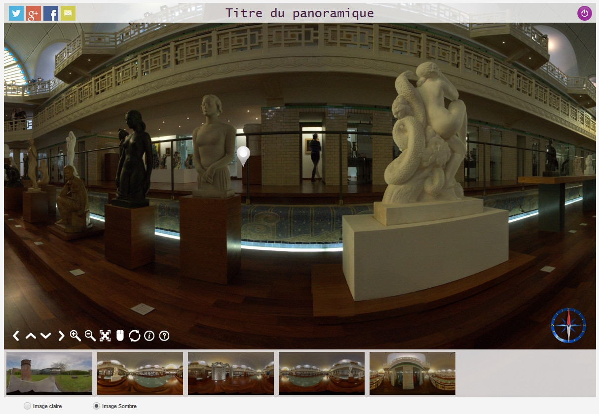

L'**éditeur d'interface** permet de personnaliser entièrement l'apparence et le comportement de la visite virtuelle. Il regroupe tous les paramètres visuels et fonctionnels dans une interface organisée en **panneaux thématiques**.

💡 **Astuce** : Les modifications sont visibles en temps réel dans l'aperçu. Utilisez `Ctrl+2` pour basculer rapidement vers cette vue.

---

### 🎨 Couleur générale de l'interface (Thème)


Ce panneau définit le thème général appliqué à tous les éléments de l'interface de la visite.

**Paramètres disponibles** :

- 🎨 **Couleur de fond** : Couleur d'arrière-plan des éléments UI (barres, fenêtres)
  - 💡 Choisissez une couleur sobre pour ne pas distraire de la visite
- 🖌️ **Couleur du texte** : Couleur de tous les textes de l'interface
  - ⚠️ Assurez un bon contraste avec la couleur de fond (ratio 4.5:1 minimum)
- 🌫️ **Opacité** : Transparence générale du thème (0 = invisible, 1 = opaque)
  - Curseur de 0 à 100% avec aperçu en temps réel
- 🔤 **Police** : Police de caractères pour l'ensemble de l'interface
  - Liste déroulante des polices système installées
  - Polices recommandées : Arial, Verdana, Roboto pour lisibilité web

**Options avancées** :

- 🔘 **Boutons Suivant/Précédent** : Active la navigation séquentielle entre panoramiques
  - Sélection du calque d'affichage (niveau de superposition)
  - Utile pour les visites guidées linéaires

⚠️ **Important** : Les changements de thème affectent **tous les éléments** sauf ceux ayant des paramètres spécifiques définis dans leurs panneaux dédiés.

---

### 📝 La barre de titre


Affiche le titre de la visite et/ou du panoramique actuel en haut ou en bas de l'écran.

**Activation et contenu** :

- ☑️ **Afficher le titre** : Active/désactive l'affichage de la barre de titre
- 📋 **Calque** : Niveau de superposition (1-10) pour gérer les chevauchements
- 🏷️ **Titre de la visite** : Affiche le titre global de la visite (défini dans Menu Projet)
- 🏞️ **Titre du panoramique** : Affiche le titre du panoramique actuel (défini dans paramètres)

💡 **Astuce** : Vous pouvez afficher les deux titres simultanément pour un contexte complet (ex: "Château de Versailles > Galerie des Glaces")

**Style et apparence** :

- 📍 **Position** : Haut, Bas, Haut-Gauche, Haut-Droite, Bas-Gauche, Bas-Droite
- ↔️ **Décalage X/Y** : Ajustement fin de la position en pixels
  - Utile pour éviter les chevauchements avec d'autres éléments
- 🔤 **Police de caractère** : Sélection de la fonte (liste déroulante système)
- 📏 **Taille de la police** : Taille du texte en pixels (8-72px typiquement)
- 🎨 **Couleur du texte** : Sélecteur de couleur pour le texte
- 🖌️ **Couleur de fond** : Couleur d'arrière-plan de la barre de titre
- 🌫️ **Opacité** : Transparence de l'arrière-plan (0-100%)
- 📐 **Taille de la barre** : Hauteur de la barre en % de l'écran
- 📦 **Taille adaptée au contenu** : Ajuste automatiquement la hauteur selon le texte

**Configuration typique** :
```
Position: Haut
Police: Arial, 18px
Couleur texte: Blanc (#FFFFFF)
Couleur fond: Noir (#000000)
Opacité: 70%
```

⚠️ **Attention** : Une opacité trop faible rend le titre illisible sur certains panoramiques.

---

### 🎛️ La barre de navigation


La barre de navigation regroupe les contrôles principaux de la visite virtuelle. EditeurPanovisu propose **deux types de barres** :

#### 🔵 Barre de Navigation Classique

Barre prédéfinie avec boutons standards stylisés.

**Style et couleur** :

- 🎭 **Style** : 4 styles visuels prédéfinis (Simple, Moderne, Flat, Dégradé)
- 🎨 **Couleur de la barre** : Teinte appliquée aux boutons
  - Les icônes s'adaptent automatiquement au contraste

**Position et disposition** :

- 📍 **Position** : 9 emplacements (Haut, Bas, Gauche, Droite + combinaisons)
- ↔️ **Offset X/Y** : Décalage en pixels pour ajustement fin
- 📏 **Espacement des boutons** : Distance entre les boutons (0-50px)

**Visibilité des éléments** :

- ☑️ **Barre de déplacement** : Boutons directionels (↑ ↓ ← →)
- ☑️ **Barre de zoom** : Boutons zoom avant/arrière (+ -)
- ☑️ **Barre d'outils** : Outils supplémentaires :
  - 🔄 **Bouton Autorotation** : Lance la rotation automatique du panoramique
  - 🖵 **Bouton Plein Écran** : Passe en mode plein écran (F11)
  - 🖱️ **Bouton Mode Souris** : Change le mode d'interaction (drag/clic)

💡 **Astuce** : Désactivez les barres inutiles pour une interface épurée (ex: désactiver zoom sur mobile où le pinch fonctionne).

#### 🌈 Barre de Navigation Personnalisée

Barre totalement customisable avec images personnalisées.

**Configuration générale** :

- ☑️ **Affiche la barre personnalisée** : Active cette barre (peut coexister avec la classique)
- 🖼️ **Choix de l'image** : Sélection d'une image PNG/SVG personnalisée
  - Recommandé : Images PNG transparentes 128x128px ou SVG vectoriel
- 📐 **Taille** : Largeur de la barre en pixels
- 🔍 **Taille des icônes** : Dimension des icônes individuelles
- 🎨 **Couleur** : Couleur d'origine ou couleur personnalisée
  - "Couleur d'origine" conserve la couleur de l'image source
  - "Couleur personnalisée" applique une teinte (fonctionne mieux avec SVG)

**Position** :

- 📍 **Position** : 9 emplacements possibles
- ↔️ **Offset X/Y** : Ajustement pixel par pixel

**Liens personnalisés** :

- 🔗 **Lien 1** : Première image personnalisée avec action associée
- 🔗 **Lien 2** : Deuxième image personnalisée avec action
- 🛠️ **Éditer** : Bouton pour configurer les actions (URL, JavaScript, etc.)

💡 **Cas d'usage** : Créez des boutons corporate avec votre logo, des liens vers réseaux sociaux, ou des actions spécifiques (télécharger brochure, contacter, etc.)

---

### 🎯 Les Hotspots (Styles)


Ce panneau définit l'**apparence visuelle** des HotSpots dans les panoramiques. Ne confondez pas avec la création de HotSpots qui se fait dans l'Éditeur de Visite.

#### 🏞️ Hotspots Panoramique (Navigation)

Style des points de navigation entre panoramiques.

- 🎨 **Couleur des Hotspots Pano** : Teinte des points de navigation
  - Recommandé : Couleurs vives et contrastées (bleu, vert, rouge)
- 📏 **Taille** : Dimension des points en pixels (16-64px typiquement)
- 🔺 **Forme** : Sélection de la forme (Cercle, Carré, Triangle, Étoile, etc.)
  - 12 formes prédéfinies disponibles
- 🖼️ **Image personnalisée** : Utiliser votre propre icône PNG/SVG
  - Recommandé : PNG transparent 64x64px

💡 **Convention** : Utilisez une couleur cohérente pour tous les HotSpots de navigation (ex: bleu = navigation, rouge = photos).

#### 📷 Hotspots Photo

Style des points qui ouvrent des images.

- 🎨 **Couleur des Hotspots Photo** : Teinte distincte pour différencier des HotSpots Pano
  - Suggestion : Orange ou jaune pour évoquer "photo"
- 📏 **Taille** : Dimension des points photo
- 🔺 **Forme** : Forme spécifique (suggestion : carré ou rectangle)
- 🖼️ **Image personnalisée** : Icône custom (suggestion : icône appareil photo)

#### 🌐 Hotspots HTML

Style des points qui ouvrent du contenu HTML.

- 🎨 **Couleur des Hotspots HTML** : Couleur dédiée aux contenus interactifs
  - Suggestion : Vert ou violet pour "contenu spécial"
- 📏 **Taille** : Dimension des points HTML
- 🔺 **Forme** : Forme distinctive (suggestion : hexagone ou diamant)
- 🖼️ **Image personnalisée** : Icône custom (suggestion : icône "i" d'information)

⚠️ **Recommandation UX** : Utilisez des **codes couleur cohérents** dans toute la visite pour que l'utilisateur comprenne instantanément le type d'interaction.

**Exemple de code couleur** :
- 🔵 Bleu : Navigation entre panoramiques
- 🟠 Orange : Photos et galeries
- 🟣 Violet : Informations HTML / Vidéos

---

### 🧭 La boussole


Affiche une boussole indiquant l'orientation du regard dans le panoramique.

**Image et style** :

- 🖼️ **Choix de l'image** : Sélection de l'image de boussole
  - 8 modèles prédéfinis fournis (classique, moderne, minimaliste, etc.)
  - Possibilité d'utiliser une image personnalisée PNG/SVG
  - Recommandé : Image carrée 256x256px avec fond transparent

**Position et taille** :

- 📍 **Position** : 9 emplacements (coins et bords de l'écran)
  - Position typique : Haut-Droite ou Bas-Droite
- ↔️ **Décalage X/Y** : Ajustement fin en pixels pour éviter chevauchements
- 📏 **Taille** : Dimension de la boussole (50-300px)
  - Taille recommandée : 80-120px pour bonne visibilité sans encombrement

**Apparence** :

- 🌫️ **Opacité** : Transparence de la boussole (0-100%)
  - Valeur typique : 80-90% pour ne pas masquer le panoramique

**Comportement** :

- ☑️ **Affichage de la boussole** : Active/désactive la boussole
- 🔄 **Aiguille Mobile** : Deux modes :
  - ✅ **Activé** : L'aiguille (nord) reste fixe, le cadran tourne (réaliste)
  - ❌ **Désactivé** : Le cadran reste fixe, l'aiguille tourne (plus simple)

💡 **Astuce** : La boussole est particulièrement utile pour les visites extérieures (monuments, paysages) où l'orientation géographique compte. Pour les intérieurs (maisons, musées), elle est optionnelle.

⚠️ **Prérequis** : Pour que la boussole fonctionne correctement, les panoramiques doivent avoir leur **orientation Nord correctement définie** lors de la prise de vue ou dans les métadonnées.

---

### 👁️ Le bouton de Masquage


Bouton permettant à l'utilisateur de masquer temporairement les éléments de l'interface pour une vue immersive "propre".

**Image et style** :

- 🖼️ **Choix de l'image du bouton** : Sélection de l'icône
  - 6 modèles prédéfinis fournis (œil, flèches, etc.)
  - Image personnalisée possible (PNG/SVG 64x64px recommandé)
- 🎨 **Couleur du bouton** : Teinte appliquée à l'icône

**Position et taille** :

- 📍 **Position** : 9 emplacements possibles
  - Position typique : Bas-Droite (facilement accessible)
- ↔️ **Décalage X/Y** : Ajustement pixel par pixel
- 📏 **Taille** : Dimension du bouton (32-96px)
- 🌫️ **Opacité** : Transparence du bouton (0-100%)

**Éléments masquables** :

Cochez les éléments que le bouton pourra masquer/afficher :

- ☑️ **Masque la barre de Navigation** : Cache les contrôles de navigation
- ☑️ **Masque la Boussole** : Cache la boussole
- ☑️ **Masque le Titre** : Cache la barre de titre
- ☑️ **Masque le Plan** : Cache la mini-carte/plan
- ☑️ **Masque les Réseaux Sociaux** : Cache les boutons de partage

**Comportement** :

- ☑️ **Affichage du Bouton** : Active/désactive le bouton de masquage

💡 **Usage recommandé** : Activez cette fonction pour permettre aux utilisateurs de profiter pleinement des panoramiques sans distraction. Particulièrement utile pour :
- 📸 Prises de captures d'écran propres
- 🎥 Projections en plein écran
- 🖼️ Appréciation artistique des photos panoramiques

⚠️ **UX** : Le bouton lui-même reste toujours visible pour permettre de réafficher l'interface.

---

### 📱 Les réseaux Sociaux


Boutons de partage sur les réseaux sociaux pour diffuser la visite virtuelle.

**Réseaux supportés** :

- 📘 **Facebook** : Partage sur Facebook avec aperçu de la visite
- 🐦 **Twitter** : Tweet avec lien vers la visite
- 💼 **LinkedIn** : Partage professionnel
- 📧 **Email** : Envoi par email avec lien
- 🔗 **Lien direct** : Copie du lien dans le presse-papiers

**Position et apparence** :

- 📍 **Position** : 4 coins disponibles (Haut-Gauche, Haut-Droite, Bas-Gauche, Bas-Droite)
  - Position typique : Haut-Droite ou Bas-Droite
- ↔️ **Décalage X/Y** : Ajustement fin en pixels
- 📏 **Taille** : Dimension des icônes (24-64px)
  - Taille recommandée : 32-40px pour bonne visibilité
- 🌫️ **Opacité** : Transparence des boutons (0-100%)
  - Valeur typique : 80-100%

**Configuration technique** :

⚠️ **Prérequis** : Pour que les partages fonctionnent correctement, la visite doit être **hébergée en ligne** (pas en local).

**Métadonnées Open Graph** :

Les partages utilisent les métadonnées suivantes (à configurer dans les paramètres du projet) :
- Titre de la visite
- Description courte
- Image d'aperçu (première image du panoramique d'entrée par défaut)
- URL de la visite

💡 **Astuce marketing** : Activez les réseaux sociaux pour augmenter la viralité de vos visites virtuelles. Particulièrement efficace pour :
- 🏡 Visites immobilières
- 🏨 Hôtels et établissements touristiques
- 🎨 Galeries et musées virtuels
- 🏢 Showrooms d'entreprise

---

### 🖼️ Les vignettes


Bande de miniatures permettant la navigation rapide entre les panoramiques de la visite.

**Apparence** :

- 🎨 **Couleur de fond** : Couleur d'arrière-plan de la bande de vignettes
- 🖌️ **Couleur du texte** : Couleur des titres sous les vignettes

**Position** :

- 📍 **Position** : Haut, Bas, Gauche, Droite de l'écran
  - Position typique : Bas (comme un filmstrip)
- ↔️ **Décalage X/Y** : Ajustement fin de la position

**Dimensions** :

- 📏 **Taille** : Hauteur (Haut/Bas) ou largeur (Gauche/Droite) de la bande (px ou %)
  - Valeur typique : 100-150px ou 10-15% de l'écran
- 🌫️ **Opacité** : Transparence de la bande (0-100%)
  - Valeur recommandée : 85-95%

**Comportement** :

- ☑️ **Affichage des vignettes** : Active/désactive la bande de vignettes
- 🔄 **Défilement** : Automatique si plus de vignettes que l'espace disponible
- ✨ **Highlight** : La vignette du panoramique actuel est mise en évidence (bordure, opacité)

**Configuration des vignettes individuelles** :

Chaque vignette affiche :
- 🖼️ **Miniature** : Aperçu du panoramique (généré automatiquement)
- 🏷️ **Titre** : Titre du panoramique (optionnel, configurable)

💡 **Cas d'usage** : Les vignettes sont idéales pour :
- 🏡 Visites avec **nombreux panoramiques** (>5) où la navigation séquentielle est lourde
- 🎯 Permettre un **accès direct** à n'importe quel panoramique
- 📊 Donner une **vue d'ensemble** de la visite dès le départ

⚠️ **Performance** : Pour les visites avec plus de 20 panoramiques, privilégiez le **défilement paresseux** (lazy loading) pour ne pas charger toutes les miniatures d'un coup.

**Recommandation UX** :
- ✅ Activez pour visites de >5 panoramiques
- ❌ Désactivez pour visites linéaires courtes (<3 panoramiques) pour épurer l'interface

### 🗺️ Le Plan (Mini-carte intégrée)


Mini-carte interactive affichant la position actuelle et permettant la navigation dans la visite.

**Activation** :

- ☑️ **Afficher le Plan** : Active/désactive le mini-plan
- 📋 **Calque** : Niveau de superposition (1-10)
- 📁 **Replié au démarrage** : Le plan apparaît replié (onglet uniquement) au chargement
  - L'utilisateur peut le déplier en cliquant dessus

**Dimensions et position** :

- 📏 **Largeur du Plan** : Largeur en pixels (200-800px)
  - Valeur recommandée : 300-400px
- 📍 **Position** : Gauche ou Droite de l'écran
  - Position typique : Gauche (convention cartographique)

**Apparence** :

- 🎨 **Couleur de fond** : Couleur d'arrière-plan du panneau du plan
- 🖌️ **Couleur du texte** : Couleur des titres et étiquettes
- 🌫️ **Opacité** : Transparence du panneau (0-100%)

**Radar de direction** :

- ☑️ **Afficher le radar** : Active l'indicateur de direction du regard
  - Représente l'orientation actuelle de la vue sous forme de cône/secteur
- 📏 **Taille du radar** : Dimension du cône de direction (0-80px)
- 🌫️ **Opacité du radar** : Transparence de l'indicateur (0-100%)
- 🎨 **Couleur de fond radar** : Couleur de remplissage du cône
- 🖌️ **Couleur de ligne radar** : Couleur du contour du cône

💡 **Astuce** : Le plan est particulièrement utile pour :
- 🏠 Visites de grandes propriétés avec nombreux panoramiques
- 🏢 Bâtiments à plusieurs étages (utilisez des plans par niveau)
- 🌳 Espaces extérieurs étendus (parcs, campus, villages)

⚠️ **Prérequis** : Vous devez avoir défini un plan dans l'**Éditeur de Plan** (`Ctrl+3`) pour que cette fonctionnalité soit active.

---

### 🌍 La Carte (Carte géographique intégrée)


Carte interactive géographique (OpenStreetMap, Google Maps, Bing Maps) affichant l'emplacement géolocalisé des panoramiques.

**Activation** :

- ☑️ **Affichage de la Carte** : Active/désactive la carte
- 📋 **Calque** : Niveau de superposition (1-10)
- 📁 **Replié au démarrage** : La carte apparaît repliée au chargement

**Configuration géographique** :

- 🎯 **Choix du centre** : Définir manuellement le centre de la carte
  - Par défaut : Centre automatique sur les panoramiques géolocalisés
- 🔄 **Recentrer** : Recentre automatiquement sur tous les panoramiques
- 🗺️ **Choix de la carte** : Sélection du fournisseur de tuiles :
  - 🆓 OpenStreetMap (gratuit, pas de clé API)
  - 🌐 Google Maps (nécessite clé API)
  - 🔷 Bing Maps (nécessite clé API)
- 📍 **Recherche d'adresse** : Champ de recherche pour centrer sur une adresse
  - Utilise le géocodage du fournisseur sélectionné
- 🔍 **Zoom** : Niveau de zoom initial (1-20)
  - 1 = Monde entier, 20 = Vue de rue
  - Valeur recommandée : 15-17 pour visites urbaines

**Dimensions et position** :

- 📏 **Largeur** : Largeur de la carte (200-1200px)
- 📐 **Hauteur** : Hauteur de la carte (200-1200px)
  - Valeurs recommandées : 400x300px ou 600x400px
- 📍 **Position** : Gauche ou Droite de l'écran

**Apparence** :

- 🎨 **Couleur de fond** : Couleur du panneau de la carte
- 🖌️ **Couleur du texte** : Couleur des titres et contrôles
- 🌫️ **Opacité** : Transparence du panneau (0-100%)

**Radar de direction** (identique au Plan) :

- ☑️ **Afficher le radar sur la carte**
- 📏 **Taille du radar** (0-80px)
- 🌫️ **Opacité du radar** (0-100%)
- 🎨 **Couleur de fond radar**
- 🖌️ **Couleur de ligne radar**
- 🔺 **Angle du radar** : Orientation du cône (0-720°)
- 📐 **Ouverture du radar** : Angle d'ouverture du cône (0-100°)
  - Valeur recommandée : 35-50° pour représenter le champ de vision

💡 **Cas d'usage** : La carte est idéale pour :
- 🏙️ Visites touristiques urbaines (monuments, quartiers)
- 🏞️ Parcours nature géolocalisés (randonnées, sentiers)
- 🏘️ Visites de plusieurs sites distincts (agence immobilière, réseau de magasins)
- 🗺️ Context géographique important (orientation, distances)

⚠️ **Prérequis technique** :
- Les panoramiques doivent avoir des **coordonnées GPS définies** (voir Éditeur de Visite → Géolocalisation)
- Pour Google Maps/Bing Maps : **Clé API requise** (voir Menu Configuration → Clés API)
- **Connexion Internet requise** pour charger les tuiles de carte

**Configuration de clé API** :
1. Google Maps : https://console.cloud.google.com/ → API Maps JavaScript
2. Bing Maps : https://www.bingmapsportal.com/ → Créer une clé

---

### 🖼️ Images de fond personnalisées


Ajoutez des images flottantes décoratives ou fonctionnelles sur l'interface de la visite (logos, watermarks, badges, etc.)

**Ajout d'images** :

- ➕ **Ajouter une image** : Bouton pour sélectionner une nouvelle image
  - Formats supportés : PNG (transparence recommandée), JPG, GIF, SVG

**Configuration de chaque image** :

- 📍 **Position** : 9 emplacements possibles (coins, centres, bords)
- ↔️ **Décalage X/Y** : Ajustement pixel par pixel
- ☑️ **Masquable** : L'image peut être cachée avec le bouton de masquage
- 🌫️ **Opacité** : Transparence de l'image (0-100%)
- 📏 **Taille** : Dimension de l'image (px ou %)
  - Conserve les proportions automatiquement
- 🔗 **URL** : Lien hypertexte activé au clic sur l'image
  - Laissez vide pour image décorative sans action
- 💬 **Info-bulle** : Texte affiché au survol de l'image
- 🎭 **Type d'action** :
  - 🔗 **Lien URL** : Ouvre une page web au clic
  - 📽️ **Diaporama** : Lance un diaporama au clic (sélection de dossier)

💡 **Cas d'usage typiques** :
- 🏢 **Logo d'entreprise** : En haut à gauche (position standard)
- ©️ **Watermark copyright** : En bas à droite avec opacité 50%
- 🏆 **Badge "Visite 360° certifiée"** : En haut à droite
- 🔖 **Bouton d'appel à l'action** : "Contactez-nous", "Réservez" avec URL
- 🎨 **Éléments décoratifs** : Bordures, cadres, ornements

⚠️ **Bonnes pratiques** :
- Utilisez des **PNG transparents** pour des intégrations propres
- Limitez le nombre d'images (max 5) pour ne pas surcharger l'interface
- Placez les logos en zones **non intrusives** (coins, bords)
- Utilisez une opacité réduite (50-70%) pour les watermarks

---

### 🔘 Menu contextuel personnalisé


Ajoutez des entrées personnalisées au menu contextuel (clic droit) du panoramique.

**Configuration** :

- 📝 **Entrée 1** :
  - 🏷️ **Libellé** : Texte affiché dans le menu (ex: "Télécharger la brochure")
  - 🔗 **URL** : Lien activé au clic (ex: "https://example.com/brochure.pdf")
- 📝 **Entrée 2** :
  - 🏷️ **Libellé** : Deuxième entrée personnalisée
  - 🔗 **URL** : Deuxième lien

💡 **Cas d'usage** :
- 📄 Télécharger documentation (PDF, plans, fiches techniques)
- 📧 Contact direct (mailto:contact@example.com)
- 🛒 Lien vers boutique en ligne
- 📞 Appel téléphonique sur mobile (tel:+33123456789)
- 🎥 Lien vers vidéo de présentation

---

### ▶️ Visite automatique


Bouton permettant de lancer un mode de visite automatique guidée (navigation automatique entre panoramiques).

**Configuration** :

- 📏 **Taille du bouton** : Dimension du bouton (32-96px)
- 📍 **Position** : 9 emplacements possibles
  - Position recommandée : Bas-Droite ou Haut-Droite
- ↔️ **Décalage X/Y** : Ajustement fin en pixels
- ⏱️ **Durée par panoramique** : Temps d'affichage avant passage au suivant (secondes)
  - Valeur recommandée : 5-10 secondes
- 🔄 **Ordre de visite** : Séquence définie dans l'Éditeur de Visite
  - Suit l'ordre d'ajout des panoramiques ou ordre personnalisé

💡 **Usage** : Idéal pour :
- 🎬 Présentation automatique type "slideshow"
- 🏨 Visite guidée non-interactive (salons, événements)
- 🎥 Capture vidéo d'écran de la visite
- 👴 Accessibilité (utilisateurs peu familiers avec navigation)

⚠️ **UX** : Prévoyez toujours un bouton "Pause" ou "Stop" visible pour que l'utilisateur puisse reprendre le contrôle.

---

### 🎨 Info-bulles personnalisées


Personnalisation complète du style des info-bulles (tooltips) affichées au survol des éléments interactifs.

**Style de texte** :

- 🔤 **Police de caractère** : Sélection de la fonte
- 📏 **Taille de la police** : Taille du texte (8-24px)
  - Valeur recommandée : 12-14px
- 🎨 **Couleur du texte** : Couleur de la fonte

**Apparence de la bulle** :

- 🖌️ **Couleur de fond** : Couleur d'arrière-plan de la bulle
- 🔲 **Couleur de bordure** : Couleur du contour de la bulle
- 🌫️ **Opacité** : Transparence globale (0-100%)
  - Valeur recommandée : 85-95%
- 📐 **Taille de bordure** : Épaisseur du contour (0-5px)
- 🔘 **Rayon de bordure** : Arrondi des coins (0-20px)
  - 0 = coins carrés, 20 = coins très arrondis

💡 **Design tips** :
- **Contraste élevé** : Assurez un ratio texte/fond ≥ 4.5:1
- **Fond sombre + Texte clair** : Plus lisible (ex: #333333 + #FFFFFF)
- **Coins arrondis** : Rayon 5-8px pour un look moderne
- **Bordure subtile** : 1-2px pour délimiter sans alourdir

---

### 🚪 Fenêtre d'information et d'aide personnalisées


Configurez l'apparence des fenêtres d'information contextuelle et d'aide intégrées à la visite.

#### Fenêtre d'Information

- ☑️ **Afficher la fenêtre d'information** : Active la fenêtre
- 🖼️ **Image de la fenêtre** : Icône personnalisée (PNG/SVG 32x32px)
- 📏 **Taille fenêtre** : Largeur et hauteur (px)
- 🌫️ **Opacité** : Transparence (0-100%)
- ↔️ **Position X/Y** : Placement à l'écran
- 🔗 **URL** : Lien hypertexte associé à l'icône
- 📝 **Texte de l'URL** : Libellé du lien (ex: "En savoir plus")
- 📏 **Taille Police** : Taille du texte dans la fenêtre
- 🎨 **Couleur texte URL** : Couleur des liens hypertextes

#### Fenêtre d'Aide

Configuration identique à la fenêtre d'information, mais dédiée à l'aide utilisateur.

💡 **Usage différencié** :
- ℹ️ **Fenêtre Info** : Informations contextuelles sur le panoramique actuel (histoire, détails techniques)
- 🆘 **Fenêtre Aide** : Instructions d'utilisation de l'interface (navigation, contrôles)

---

## Les Outils

### Les outils de transformation

#### Cube vers Équirectangulaire


Convertit 6 faces d'un cube (panorama cubique) en une seule image équirectangulaire (sphérique).

**Utilisation** :

1. 📂 **Sélectionner les 6 faces** : Front, Back, Left, Right, Top, Bottom
   - Format requis : Images carrées de même dimension (1024x1024, 2048x2048, 4096x4096)
   - Formats supportés : JPG, PNG, TIFF
2. ⚙️ **Paramètres de conversion** :
   - 📐 **Résolution de sortie** : Largeur de l'image finale (4096, 8192, 16384px)
   - 🎨 **Qualité JPEG** : 80-100% (si sortie JPG)
3. 🖱️ **Générer** : Lance la conversion
   - ⏱️ Durée : 5-30 secondes selon résolution

💡 **Quand utiliser** :
- Import depuis logiciels de rendu 3D (Blender, 3ds Max) qui exportent en cubemap
- Panoramas générés depuis jeux vidéos
- Conversion depuis format Facebook 360

⚠️ **Important** : Les 6 faces doivent être correctement orientées (convention standard : Unity, Three.js).

#### Équirectangulaire vers Cube


Convertit une image équirectangulaire (panorama sphérique) en 6 faces cubiques.

**Utilisation** :

1. 📂 **Sélectionner l'image source** : Image panoramique équirectangulaire
   - Format requis : Ratio 2:1 (ex: 8192x4096, 4096x2048)
   - Formats supportés : JPG, PNG, TIFF
2. ⚙️ **Paramètres de conversion** :
   - 📐 **Résolution par face** : Dimension de chaque face cubique (1024, 2048, 4096px)
   - 🎨 **Format de sortie** : JPG ou PNG
3. 📁 **Dossier de sortie** : Sélection du dossier pour les 6 images
   - Nommage automatique : face_front.jpg, face_back.jpg, etc.
4. 🖱️ **Générer** : Lance la conversion

💡 **Quand utiliser** :
- Export vers moteurs de jeu (Unity, Unreal Engine) qui utilisent cubemaps
- Réduction de la résolution pour performances (cubemaps plus légers)
- Travail sur des faces individuelles (retouche Photoshop face par face)

---

## L'éditeur de plan


*Section à documenter ultérieurement*

Cette section permettra de créer et configurer les mini-cartes/plans de la visite avec positionnement des panoramiques.

⏱️ Voir documentation complète dans une prochaine mise à jour.

---

## 🆘 Besoin d'aide ?

Si vous rencontrez des difficultés ou avez des questions :

- 📖 **Documentation complète** : Menu Aide → Documentation (F1)
  - Installation d'Ollama pour l'IA
  - Guides détaillés par fonctionnalité
- 🆘 **Aide contextuelle** : Menu Aide → Aide (`Ctrl+H`)
- 📧 **Support** : contact@panovisu.com (pour utilisateurs licenciés)
- 🌐 **Site web** : https://www.panovisu.com
  - Forum utilisateurs, tutoriels vidéo, FAQ

---

**EditeurPanovisu** - Créateur de visites virtuelles 360°  
Version 2.x - © 2024 - Tous droits réservés


