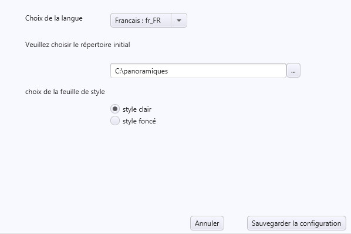

# Aide Panovisu

## Table des matières

- [Premiers pas](#premiers-pas)
- [Les Menus](#les-menus)
  - [Menu Projets](#menu-projets)
  - [Menu Panoramiques](#menu-panoramiques)
  - [Menu Modèles](#menu-modèles)
  - [Menu Outils](#menu-outils)
  - [Menu Aide](#menu-aide)
  - [La barre d'icônes](#la-barre-dicônes)
- [L'éditeur de visite](#léditeur-de-visite)
- [L'éditeur d'interface](#léditeur-dinterface)
- [Les Outils](#les-outils-1)
- [L'éditeur de plan](#léditeur-de-plan)

---

## Premiers pas ou comment réaliser une visite en 5 minutes

⚠️ **N'oubliez pas de sauvegarder votre projet régulièrement**

### Dans l'onglet visite

1. **Charger les panoramiques** (menu Visite ⇒ Ajouter panoramiques ou **Ctrl+A** (PC) ou **Cmd+A** (Mac))

   

2. **Choisir le panoramique d'entrée**

   

3. **Choisir le titre de chacun des panoramiques**

   

4. **Créer les liaisons entre les panoramiques :**

   - **Clic bouton gauche** sur la vue panoramique pour choisir l'emplacement du Hotspot

     

   - Choisissez le panoramique lié par le hotspot en **clic bouton gauche** sur son image (vous pourrez l'éditer en recliquant sur le point ou en choisissant le panoramique lié par l'intermédiaire de la boîte de choix).

     

     Le texte du lien créé sera le titre du panoramique sélectionné par défaut (vous pouvez l'éditer)

     

   - Si vous vous êtes trompé vous pouvez supprimer le point en utilisant la combinaison (**Ctrl+clic gauche** (PC) ou **Cmd+clic gauche** (Mac) sur le point)

   - Vous pouvez de la même manière créer un lien vers une image en utilisant la combinaison **Shift+clic gauche**

   Dans l'interface :
   - La ligne rouge représente la direction du nord
   - La croix violette le point de vue d'entrée du panoramique
   - Les points jaune/rouge les hotspots vers les autres panoramiques

   

5. Pour chacun des panoramiques vous pouvez également choisir le **point de vue d'entrée** (**clic droit**) - la direction dans laquelle se porte le regard lorsque le panoramique est chargé. Le centre de l'image est choisi par défaut.

6. De même si vous comptez utiliser la boussole choisissez la **position du nord** (**Shift + clic droit**)

---

### Dans l'onglet Modèle d'interface

1. **Choisissez la couleur générale de l'interface.** La couleur de chacun des éléments pourra ensuite être choisie individuellement.

   

2. **Paramétrez le titre** (choix de la police, de sa taille, couleurs, etc...)

   

3. **Paramétrez la barre de navigation** (forme des boutons, couleur, position, etc...)

   

4. **Paramétrez les hotspots** (forme et couleur)

   

5. **Paramétrez la boussole** (affichage, forme, position, etc...)

   

6. **Paramétrez le bouton de masquage** (affichage, position, couleur, ainsi que les éléments à masquer par le bouton)

   

7. **Paramétrez les réseaux sociaux** (affichage, choix des réseaux à afficher)

   

8. **Paramétrez l'affichage des vignettes** des panoramiques (position, couleur de fond, taille des vignettes)

   

💡 **Vous pouvez sauvegarder le modèle que vous venez de créer** pour une utilisation ultérieure en utilisant le menu modèles.

---

### Génération de la visite

Si vous n'avez pas encore sauvé votre visite faites-le, puis **générez votre visite** en utilisant le menu visite (ou la combinaison de touche **Ctrl+V** (PC) ou **Cmd+V** (Mac)). La visite sera générée dans le répertoire de sauvegarde dans un sous-répertoire `visite`.

Une fois la génération effectuée, la visite sera ouverte dans votre navigateur préféré.

---

## Les Menus

### Menu Projets

### Menu Panoramiques

### Menu Modèles

### Menu Outils

### Menu Aide

### La barre d'icônes

---

## L'éditeur de visite

### Le panneau de la vue panoramique

### La barre d'outils

#### Panoramique d'entrée

#### Les paramètres du panoramique

#### Les HotSpots

---

## L'éditeur d'interface

### Couleur générale de l'interface

### La barre de titre

### La barre de navigation

### Les Hotspots

### La boussole

### Le bouton de Masquage

### Les réseaux Sociaux

### Les vignettes

---

## Les Outils

### Les outils de transformation

#### Cube vers Équirectangulaire

#### Équirectangulaire vers Cube

### Configuration

---

## L'éditeur de plan

📋 *Section à documenter*
